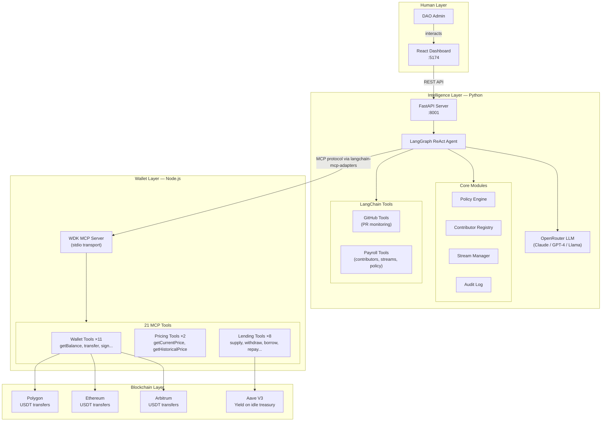
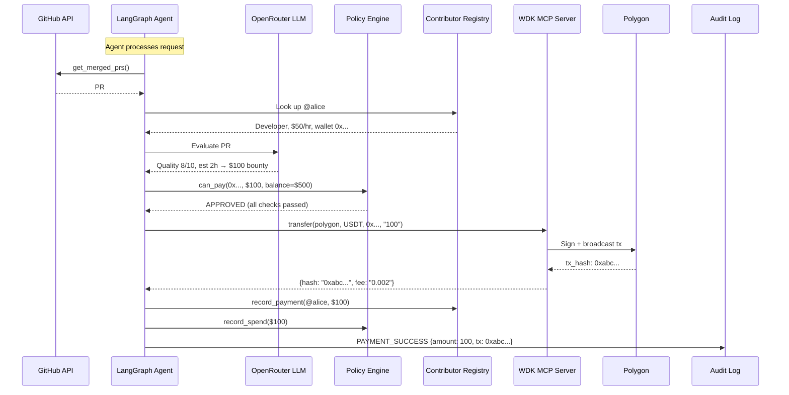
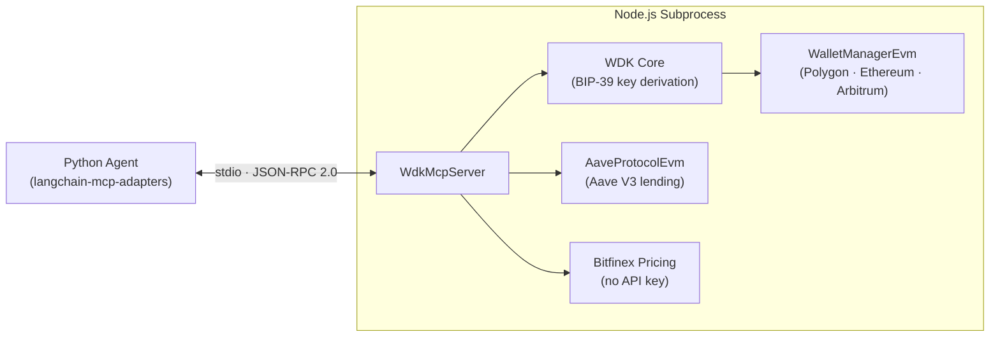
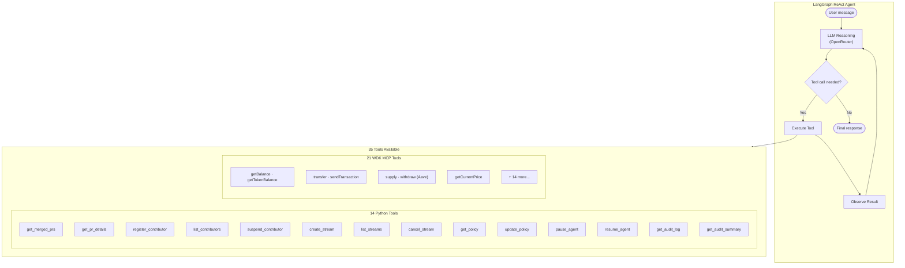
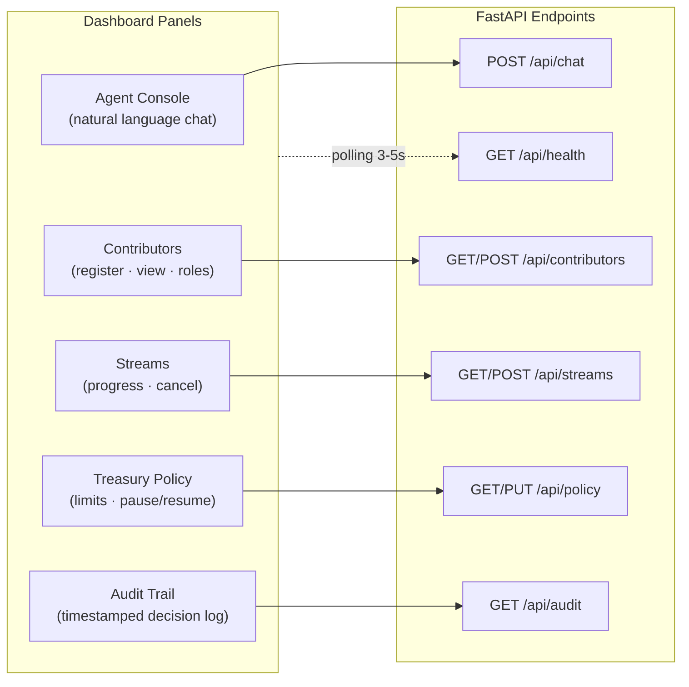
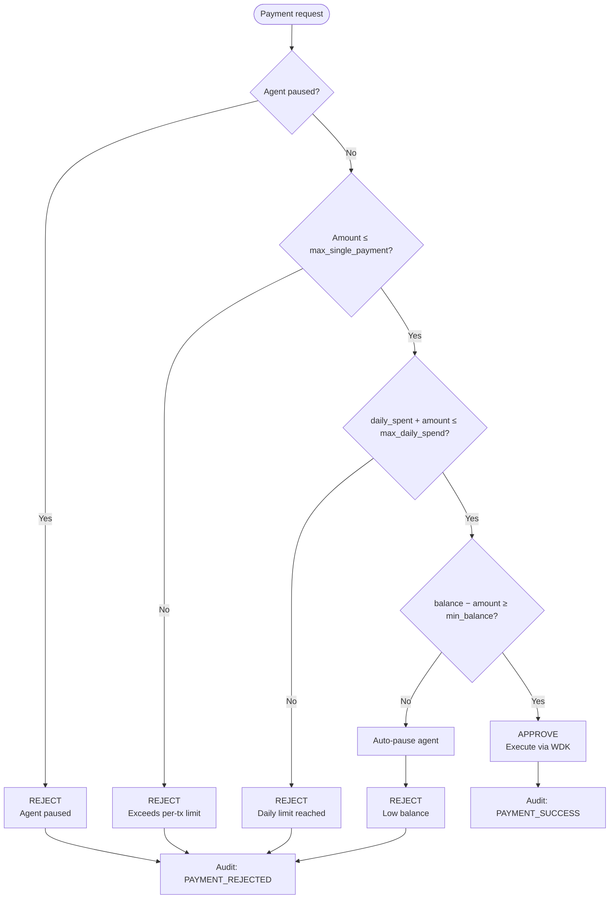
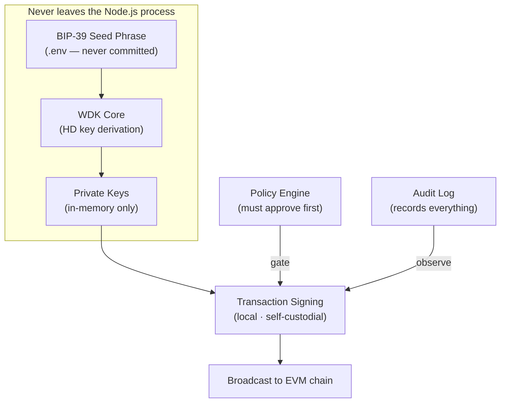

# PayStream — Architecture

Deep technical documentation for the Autonomous Payroll DAO Agent.

---

## System Overview

PayStream is a **three-layer system**: a React dashboard for humans, a Python LangGraph agent for reasoning, and a Node.js WDK MCP server for blockchain operations.



---

## Data Flow: PR → Payment

The core value proposition — turning a merged GitHub PR into an autonomous USDT payment.



---

## Component Details

### 1. WDK MCP Server (`wdk-server/`)

A Node.js process that runs as a **subprocess** of the Python agent, communicating via **stdio** using the Model Context Protocol (JSON-RPC 2.0).



**Key implementation details:**
- Auto-generates BIP-39 seed phrase if `WDK_SEED` is missing or invalid (`WDK.isValidSeed()` + `WDK.getRandomSeedPhrase()`)
- Explicitly creates `StdioServerTransport` and connects — required by WDK MCP Toolkit
- Registers USDT token addresses on all three chains for balance queries and transfers

**Registered chains:**

| Chain | Provider | USDT Address |
|-------|----------|-------------|
| Polygon | `polygon-rpc.com` | `0xc2132D05D31c914a87C6611C10748AEb04B58e8F` |
| Ethereum | `eth.drpc.org` | `0xdAC17F958D2ee523a2206206994597C13D831ec7` |
| Arbitrum | `arb1.arbitrum.io/rpc` | `0xFd086bC7CD5C481DCC9C85ebE478A1C0b69FCbb9` |

**MCP tools (21 registered):**
- **11 Wallet** — getAddress, getBalance, getTokenBalance, getFeeRates, quoteSendTransaction, quoteTransfer, sendTransaction, transfer, sign, verify, getMaxSpendableBtc
- **2 Pricing** — getCurrentPrice, getHistoricalPrice
- **8 Lending** — quoteSupply, supply, quoteWithdraw, withdraw, quoteBorrow, borrow, quoteRepay, repay

### 2. Python Agent (`agent/`)

The intelligence layer built on **LangGraph**.



**MCP connection (langchain-mcp-adapters v0.1.0+):**
```python
# No context manager — new API
mcp_client = MultiServerMCPClient({
    "wdk": {
        "command": "node",
        "args": ["../wdk-server/index.js"],
        "transport": "stdio",
        "env": {**os.environ, "WDK_SEED": seed},
    },
})
wdk_tools = await mcp_client.get_tools()
```

**Core modules:**

| Module | File | Responsibility |
|--------|------|---------------|
| **Policy Engine** | `core/policy_engine.py` | Budget enforcement: daily caps, single tx limits, min balance, auto-pause |
| **Contributor Registry** | `core/contributor_registry.py` | Team management: roles, hourly rates, earnings tracking, suspension |
| **Stream Manager** | `core/stream_manager.py` | Payment streaming: continuous USDT drip to recipients over time |
| **Audit Log** | `core/audit_log.py` | Immutable timestamped record of every decision and action |

**FastAPI endpoints:**

| Method | Path | Description |
|--------|------|-------------|
| `POST` | `/api/chat` | Send natural language message to the agent |
| `GET` | `/api/contributors` | List all contributors |
| `POST` | `/api/contributors` | Register a new contributor |
| `GET` | `/api/streams` | List all payment streams |
| `POST` | `/api/streams` | Create a new stream |
| `POST` | `/api/streams/:id/cancel` | Cancel an active stream |
| `GET` | `/api/policy` | Get current policy + status |
| `PUT` | `/api/policy` | Update policy limits |
| `POST` | `/api/policy/pause` | Pause the agent |
| `POST` | `/api/policy/resume` | Resume the agent |
| `GET` | `/api/audit` | Get recent audit entries |
| `GET` | `/api/audit/summary` | Get audit statistics |
| `GET` | `/api/health` | Health check |

### 3. Dashboard (`dashboard/`)

Production React app with **real-time polling** (3–5s intervals).



**UI features:**
- Dark theme with custom color palette (surface, accent, danger, warn)
- Inter + JetBrains Mono fonts
- Stats row (contributors, active streams, agent status)
- Real-time connection status indicator
- Custom `usePolling` hook for automatic data refresh

---

## Policy Engine Decision Tree



**Default policy values:**
| Parameter | Default | Description |
|-----------|---------|-------------|
| `max_daily_spend` | $500 | Total USDT per 24h |
| `max_single_payment` | $100 | Max per transaction |
| `min_balance` | $10 | Treasury reserve floor |
| `ai_approval_threshold` | $25 | AI reviews payments above this |
| `tick_interval_s` | 30 | Agent loop interval |

---

## Security Model



**Security properties:**
- **Self-custodial** — private keys derived from BIP-39 seed, never leave the WDK subprocess
- **Process isolation** — WDK MCP server runs as a child process, communicates only via stdio
- **Policy-gated** — every payment must pass policy checks before the agent can call `transfer`
- **Auditable** — every decision (approved or rejected) is logged with full context
- **Env-only secrets** — seed phrase and API keys loaded from `.env`, never hardcoded
- **Auto-validation** — WDK server validates seed with `WDK.isValidSeed()` before use

---

## Technology Rationale

| Decision | Choice | Why |
|----------|--------|-----|
| Agent framework | LangGraph | Production-grade stateful agent with ReAct loop, tool calling, and message history |
| LLM access | OpenRouter | Vendor-agnostic — swap between Claude, GPT-4, Llama without code changes |
| Wallet | Tether WDK + MCP Toolkit | Official toolkit, 21 tools, multi-chain, self-custodial, Aave V3 built-in |
| Agent ↔ WDK bridge | `langchain-mcp-adapters` | Official LangChain library for MCP tool integration (v0.1.0+ API) |
| API server | FastAPI | Async Python, auto-generated OpenAPI docs, Pydantic validation |
| Dashboard | React 18 + Tailwind CSS | Lightweight, production-ready, no heavy component libraries |
| Build tool | Vite | Fast HMR, ES module native, minimal config |

---

## Future Extensions

- **Persistent storage** — PostgreSQL for contributors, streams, audit (currently in-memory)
- **GitHub webhooks** — real-time PR detection instead of polling
- **Multi-repo monitoring** — watch multiple repositories simultaneously
- **Salary streaming** — continuous per-second USDT streams (stream manager already supports this)
- **Cross-chain bridging** — auto-bridge USDT between chains based on gas costs (WDK bridge tools available)
- **Multi-sig governance** — require multiple approvals for payments above threshold
- **Cloudflare Workers deployment** — deploy MCP server as edge function for global availability
