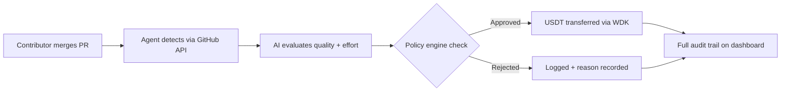
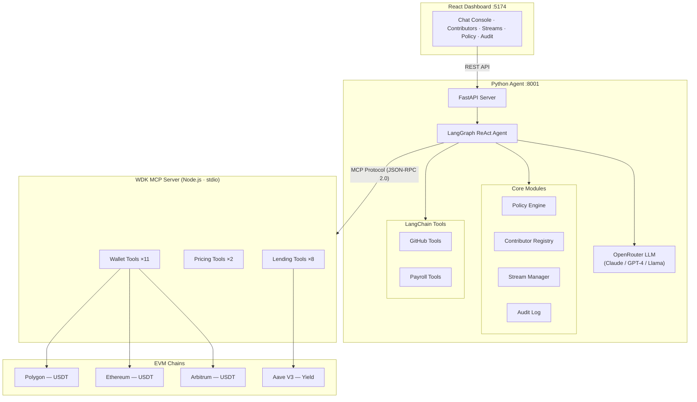
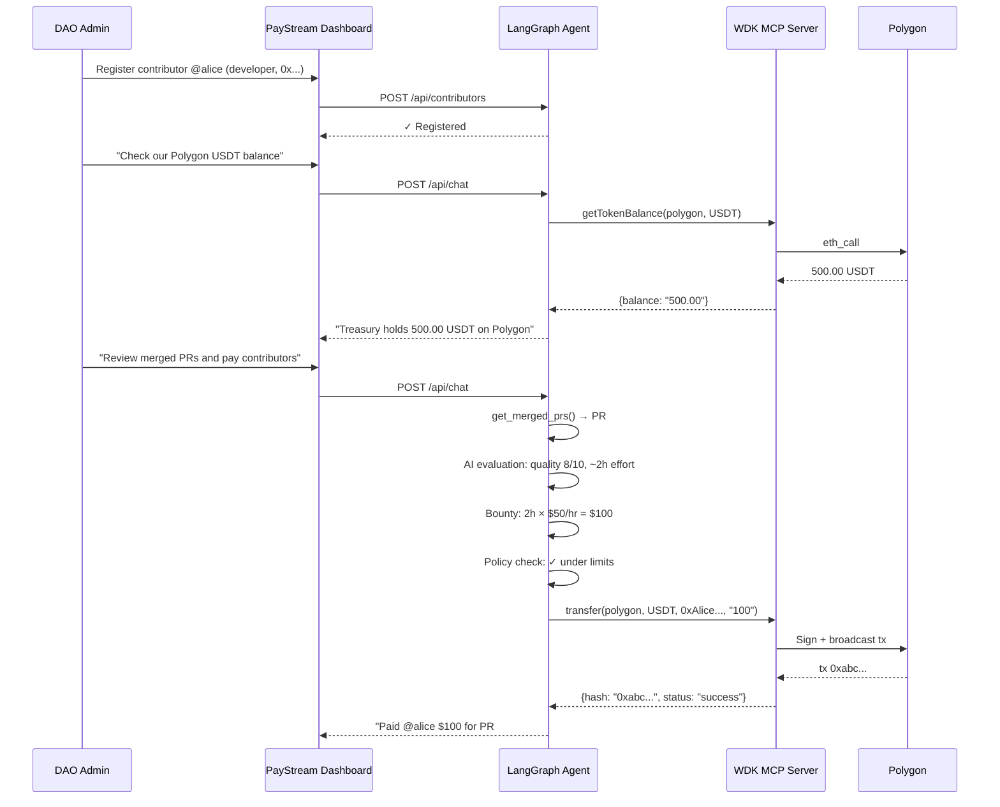
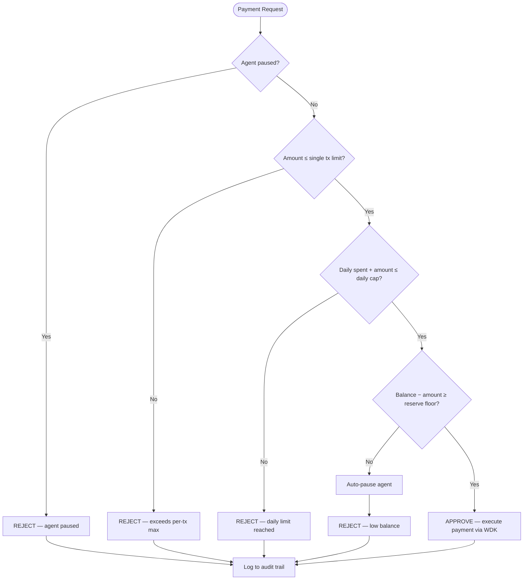

# PayStream — Autonomous Payroll DAO Agent

> AI-powered contributor rewards with self-custodial treasury via **Tether WDK**

Built for [Hackathon Galáctica: WDK Edition 1](https://dorahacks.io/hackathon/hackathon-galactica-wdk-2026-01) — **Agent Wallets Track**

---

## The Problem

Open-source projects and DAOs need to pay contributors. Today this means:
- A human treasurer manually reviewing PRs and sending payments
- No policy enforcement — one bad decision drains the treasury
- No audit trail — contributors don't know why they were paid (or weren't)
- Idle treasury capital earns zero yield

## The Solution

**PayStream** is an autonomous AI agent that manages a contributor payroll treasury end-to-end:



No human in the loop. The agent decides who gets paid, how much, and when — within policy guardrails you define. Every decision is logged and visible.

---

## Architecture



| Layer | Technology | Responsibility |
|-------|-----------|----------------|
| **Dashboard** | React 18 + Tailwind CSS + Vite | Real-time treasury monitoring, agent chat, contributor management |
| **Agent** | Python + LangGraph + FastAPI | AI reasoning, policy enforcement, GitHub monitoring, payroll logic |
| **WDK MCP** | Node.js + `@tetherto/wdk-mcp-toolkit` | 21 MCP tools — wallet ops, Aave lending, Bitfinex pricing |
| **Chains** | Polygon, Ethereum, Arbitrum | USDT transfers, Aave V3 yield on idle treasury |

> Full technical deep-dive → [ARCHITECTURE.md](./ARCHITECTURE.md)

---

## Features

### Autonomous Agent
- **LangGraph ReAct** agent with 35 tools (21 MCP + 14 Python)
- Monitors GitHub for merged PRs, evaluates quality via LLM
- Calculates fair bounties based on contributor role + effort
- Creates payment streams without human intervention

### Policy Engine
- **Daily spend cap** — prevents treasury drain
- **Single payment limit** — per-transaction ceiling
- **Minimum balance reserve** — always keeps a safety floor
- **AI approval threshold** — large payments get extra AI scrutiny
- **Auto-pause on low balance** — self-protective shutdown

### Treasury Management
- **Multi-chain wallet** via Tether WDK (Polygon + Ethereum + Arbitrum)
- **Aave V3 yield** on idle USDT — treasury earns while waiting
- **Live pricing** from Bitfinex — no API key needed
- **Self-custodial** — private keys never leave the process

### Full Audit Trail
- Every decision logged with timestamp and context
- Policy check results (approved/rejected + reason)
- AI reasoning captured for every payment decision
- Transaction hashes linked to block explorers

---

## Quick Start

### Prerequisites

- **Node.js** 18+ (with npm)
- **Python** 3.11+
- **OpenRouter API key** ([get one free](https://openrouter.ai))

### 1. Clone

```bash
git clone https://github.com/N-45div/PayStream.git
cd PayStream
```

### 2. Install WDK MCP Server

```bash
cd wdk-server
npm install
cd ..
```

### 3. Install Python Agent

```bash
cd agent
python -m venv .venv
source .venv/bin/activate   # Windows: .venv\Scripts\activate
pip install -r requirements.txt
cp .env.example .env
# Edit .env — add your OPENROUTER_API_KEY at minimum
cd ..
```

### 4. Install Dashboard

```bash
cd dashboard
npm install
cd ..
```

### 5. Run

**Terminal 1 — Agent** (auto-spawns WDK MCP server as subprocess):
```bash
cd agent && source .venv/bin/activate && python server.py
```

**Terminal 2 — Dashboard**:
```bash
cd dashboard && npm run dev
```

Open **http://localhost:5174** → you should see the PayStream dashboard connected.

> **Note:** If `WDK_SEED` is not set, the WDK server auto-generates a BIP-39 seed phrase and logs it. Save it to persist your wallet across restarts.

---

## Environment Variables

Create `agent/.env` (see `agent/.env.example`):

| Variable | Required | Default | Description |
|----------|----------|---------|-------------|
| `OPENROUTER_API_KEY` | **Yes** | — | LLM API key from [OpenRouter](https://openrouter.ai) |
| `OPENROUTER_MODEL` | No | `anthropic/claude-3.5-sonnet` | Any model on OpenRouter |
| `WDK_SEED` | No | Auto-generated | BIP-39 mnemonic for wallet |
| `GITHUB_TOKEN` | No | — | GitHub PAT for PR monitoring |
| `GITHUB_REPO` | No | — | Default repo to watch (`owner/repo`) |
| `POLYGON_RPC` | No | `https://polygon-rpc.com` | Custom Polygon RPC |
| `ETH_RPC` | No | `https://eth.drpc.org` | Custom Ethereum RPC |
| `ARB_RPC` | No | `https://arb1.arbitrum.io/rpc` | Custom Arbitrum RPC |
| `PORT` | No | `8000` | FastAPI server port |

---

## Demo Flow



---

## Project Structure

```
PayStream/
├── wdk-server/                 # Node.js — WDK MCP Server
│   ├── index.js                # Multi-chain wallet + Aave + pricing (21 tools)
│   └── package.json
├── agent/                      # Python — LangGraph AI Agent
│   ├── core/
│   │   ├── config.py           # Centralized configuration
│   │   ├── policy_engine.py    # Budget enforcement + auto-pause
│   │   ├── contributor_registry.py  # Team management + rate tracking
│   │   ├── stream_manager.py   # Payment streaming logic
│   │   └── audit_log.py        # Immutable decision log
│   ├── tools/
│   │   ├── github_tools.py     # PR monitoring via GitHub API
│   │   └── payroll_tools.py    # LangChain tools for payroll ops
│   ├── graph.py                # LangGraph ReAct agent wiring
│   ├── server.py               # FastAPI REST server
│   ├── requirements.txt
│   └── .env.example
├── dashboard/                  # React — Real-time Dashboard
│   ├── src/
│   │   ├── App.jsx             # Main UI (5 panels + stats)
│   │   ├── api.js              # API client
│   │   ├── main.jsx            # Entry point
│   │   └── index.css           # Tailwind + custom styles
│   ├── index.html
│   ├── vite.config.js
│   ├── tailwind.config.js
│   └── package.json
├── README.md
└── ARCHITECTURE.md
```

---

## How It Works



---

## Hackathon Track Alignment

| Criteria | How PayStream Addresses It |
|----------|---------------------------|
| **Technical correctness** | WDK MCP Toolkit for wallet ops, LangGraph for orchestration, FastAPI for API — clean 3-layer separation |
| **Agent autonomy** | ReAct agent reasons about PR quality, calculates bounties, enforces policy — zero manual triggers |
| **Economic soundness** | Budget caps, daily limits, min balance, AI approval for large payments, Aave V3 yield on idle treasury |
| **Real-world applicability** | Every DAO and open-source project needs automated contributor payments — deployable today |

---

## Tech Stack

| Component | Technology | Why |
|-----------|-----------|-----|
| Wallet | [Tether WDK](https://docs.wdk.tether.io) | Self-custodial, multi-chain, official toolkit |
| MCP Tools | [WDK MCP Toolkit](https://github.com/tetherto/wdk-mcp-toolkit) | 21 tools — wallet, lending, pricing |
| Agent | [LangGraph](https://langchain-ai.github.io/langgraph/) | Production-grade stateful ReAct agent |
| MCP Bridge | [langchain-mcp-adapters](https://github.com/langchain-ai/langchain-mcp-adapters) | Official LangChain ↔ MCP integration |
| LLM | [OpenRouter](https://openrouter.ai) | Vendor-agnostic — any model (Claude, GPT-4, Llama) |
| API | [FastAPI](https://fastapi.tiangolo.com) | Async Python, auto-docs, Pydantic validation |
| Dashboard | [React](https://react.dev) + [Tailwind CSS](https://tailwindcss.com) | Modern, minimal, production-ready |

---

## License

MIT
