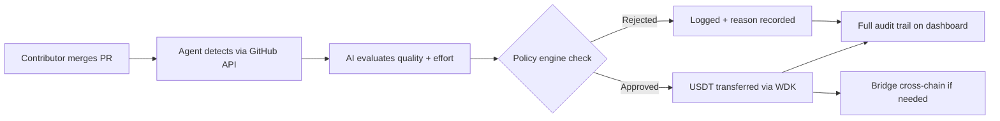
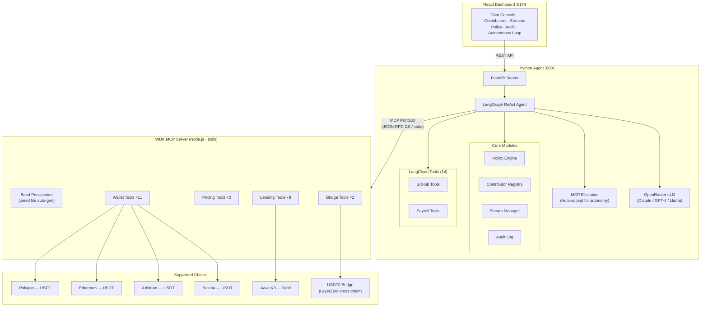
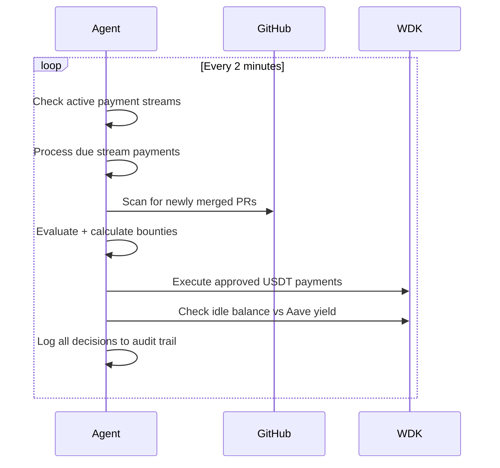
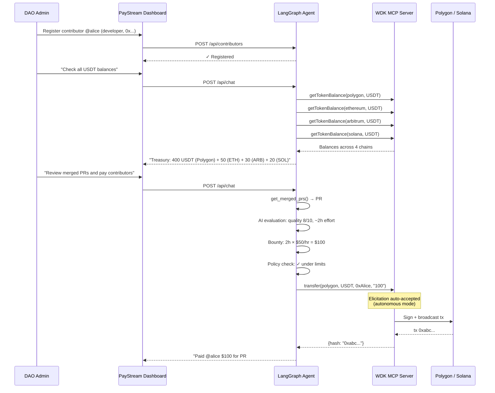
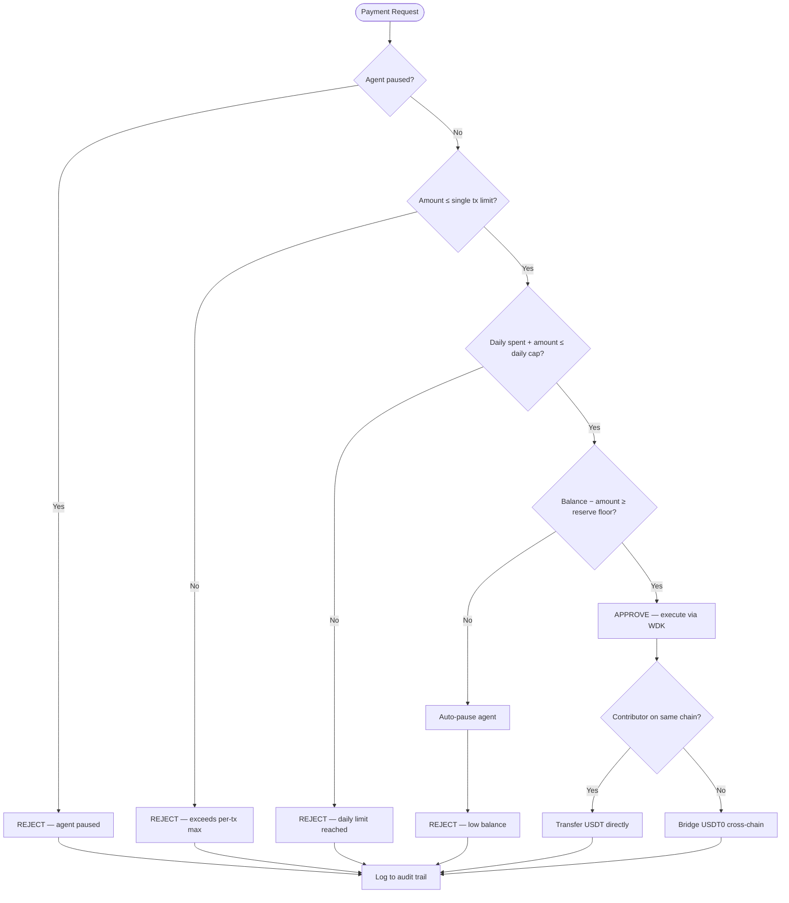
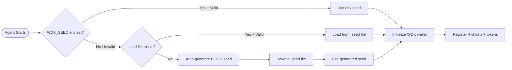

# PayStream — Autonomous Payroll DAO Agent

> Autonomous AI treasury that pays contributors, manages yield, and bridges USDT across 4 chains — self-custodial, policy-governed, zero human intervention.

Built for [Hackathon Galáctica: WDK Edition](https://dorahacks.io/hackathon/hackathon-galactica-wdk-2026-01) — **Agent Wallets Track**

**Live:** [https://paystream-1064261519338.us-central1.run.app](https://paystream-1064261519338.us-central1.run.app)

---

## The Problem

Open-source projects and DAOs need to pay contributors. Today this means:
- A human treasurer manually reviewing PRs and sending payments
- No policy enforcement — one bad decision drains the treasury
- No audit trail — contributors don't know why they were paid (or weren't)
- Idle treasury capital earns zero yield
- Cross-chain complexity — contributors on different chains can't get paid easily

## The Solution

**PayStream** is a fully autonomous AI agent that manages a multi-chain contributor payroll treasury end-to-end:



No human in the loop. The agent decides who gets paid, how much, and on which chain — within policy guardrails you define. Every decision is logged and visible.

---

## Architecture



### Component Overview

| Layer | Technology | Responsibility |
|-------|-----------|----------------|
| **Landing Page** | React + Mermaid.js | Interactive landing with 3 live mermaid diagrams (architecture, payment flow, policy engine) |
| **Dashboard** | React 18 + Tailwind CSS + Vite | Real-time treasury monitoring, agent chat with voice input (STT), autonomous loop, settings UI |
| **Agent** | Python + LangGraph + FastAPI | AI reasoning, policy enforcement, GitHub monitoring, payroll logic |
| **WDK MCP** | Node.js + `@tetherto/wdk-mcp-toolkit` | 35+ MCP tools — wallet, lending, pricing, bridging |
| **Chains** | Polygon, Ethereum, Arbitrum, **Solana** | USDT transfers, Aave V3 yield, USDT0 cross-chain bridge |

### Autonomous Loop



---

## Features

### Autonomous Agent
- **LangGraph ReAct** agent with 37+ tools (23 MCP + 14 Python)
- Monitors GitHub for merged PRs, evaluates quality via LLM
- Calculates fair bounties based on contributor role + effort
- Creates time-based payment streams without human intervention
- **MCP elicitation auto-accept** — true autonomy (no human confirmation needed for transfers)
- **Voice input (STT)** — speak commands via browser SpeechRecognition API
- **Configurable GitHub repo** — change monitored repo from dashboard at runtime

### Multi-Chain Treasury (4 Chains)
- **Polygon** — low-fee USDT payments (default for payroll)
- **Ethereum** — USDT + Aave V3 yield on idle treasury
- **Arbitrum** — fast L2 USDT transfers
- **Solana** — SPL USDT via WDK Solana wallet module
- **USDT0 Bridge** — cross-chain transfers via LayerZero

### Policy Engine
- **Daily spend cap** — prevents treasury drain
- **Single payment limit** — per-transaction ceiling
- **Minimum balance reserve** — always keeps a safety floor
- **AI approval threshold** — large payments get extra AI scrutiny
- **Auto-pause on low balance** — self-protective shutdown

### Self-Custodial Wallet
- **Auto-generated BIP-39 seed** — persisted to `.seed` file, survives restarts
- **No manual config needed** — just start the agent and a wallet is created
- **Private keys never leave the process** — true self-custody
- **EIP-55 checksummed addresses** enforced for EVM chains

### Full Audit Trail
- Every decision logged with timestamp and context
- Policy check results (approved/rejected + reason)
- AI reasoning captured for every payment decision
- Transaction hashes linked to block explorers

### x402 Payment Protocol Ready
- WDK's EVM wallet natively satisfies the x402 `ClientEvmSigner` interface
- PayStream can **pay for** external API services autonomously via HTTP 402 — no accounts, no API keys
- Can also **charge other agents** for access to its payroll API — enabling agent-to-agent economy
- USDT payments over HTTP, machine-to-machine, trustless

### Landing Page & Interactive Diagrams
- Dedicated landing page with hero, feature grid, and CTA
- **3 live mermaid diagrams** rendered in-browser: system architecture, payment flow, policy engine
- WDK module breakdown table
- Hash-based routing: `/` = landing page, `/#dashboard` = full app

---

## Quick Start

### Prerequisites

- **Node.js** 18+ (with npm)
- **Python** 3.11+
- **OpenRouter API key** ([get one free](https://openrouter.ai))

### 1. Clone

```bash
git clone https://github.com/N-45div/PayStream.git
cd PayStream
```

### 2. Install WDK MCP Server

```bash
cd wdk-server
npm install
cd ..
```

### 3. Install Python Agent

```bash
cd agent
python -m venv .venv
source .venv/bin/activate   # Windows: .venv\Scripts\activate
pip install -r requirements.txt
cp .env.example .env
# Edit .env — add your OPENROUTER_API_KEY at minimum
cd ..
```

### 4. Install Dashboard

```bash
cd dashboard
npm install
cd ..
```

### 5. Run

**Terminal 1 — Agent** (auto-spawns WDK MCP server as subprocess):
```bash
cd agent && source .venv/bin/activate && python server.py
```

**Terminal 2 — Dashboard**:
```bash
cd dashboard && npm run dev
```

Open **http://localhost:5174** → you should see the PayStream dashboard connected.

> **Note:** The wallet seed is auto-generated on first run and persisted to `wdk-server/.seed`. No manual config needed — your wallet survives restarts automatically.

---

## Environment Variables

Create `agent/.env` (see `agent/.env.example`):

| Variable | Required | Default | Description |
|----------|----------|---------|-------------|
| `OPENROUTER_API_KEY` | **Yes** | — | LLM API key from [OpenRouter](https://openrouter.ai) |
| `OPENROUTER_MODEL` | No | `stepfun/step-3.5-flash:free` | Any chat model on OpenRouter (must support tool calling) |
| `WDK_SEED` | No | Auto-generated + persisted | BIP-39 mnemonic for wallet |
| `GITHUB_TOKEN` | No | — | GitHub PAT for PR monitoring |
| `GITHUB_REPO` | No | — | Default repo to watch (`owner/repo`) |
| `POLYGON_RPC` | No | `https://polygon.llamarpc.com` | Custom Polygon RPC |
| `ETH_RPC` | No | `https://eth.llamarpc.com` | Custom Ethereum RPC |
| `ARB_RPC` | No | `https://arbitrum.llamarpc.com` | Custom Arbitrum RPC |
| `SOLANA_RPC` | No | `https://api.mainnet-beta.solana.com` | Custom Solana RPC |
| `PORT` | No | `8000` | FastAPI server port |

---

## Demo Flow



---

## Project Structure

```
PayStream/
├── wdk-server/                 # Node.js — WDK MCP Server
│   ├── index.js                # Multi-chain wallet + Aave + bridge + pricing
│   ├── .seed                   # Auto-generated wallet seed (gitignored)
│   └── package.json
├── agent/                      # Python — LangGraph AI Agent
│   ├── core/
│   │   ├── config.py           # Centralized configuration
│   │   ├── policy_engine.py    # Budget enforcement + auto-pause
│   │   ├── contributor_registry.py  # Team management + rate tracking
│   │   ├── stream_manager.py   # Payment streaming logic
│   │   └── audit_log.py        # Immutable decision log
│   ├── tools/
│   │   ├── github_tools.py     # PR monitoring via GitHub API
│   │   └── payroll_tools.py    # LangChain tools for payroll ops
│   ├── graph.py                # LangGraph ReAct agent + MCP elicitation
│   ├── server.py               # FastAPI REST server + static dashboard
│   ├── requirements.txt
│   └── .env.example
├── dashboard/                  # React — Real-time Dashboard + Landing
│   ├── src/
│   │   ├── App.jsx             # Dashboard UI (8 panels + stats + STT)
│   │   ├── Landing.jsx         # Landing page with mermaid diagrams
│   │   ├── Mermaid.jsx         # Mermaid diagram renderer (dark theme)
│   │   ├── api.js              # API client (chat, settings, autonomous)
│   │   ├── main.jsx            # Entry + hash-based routing
│   │   └── index.css           # Tailwind + custom styles
│   ├── index.html
│   ├── vite.config.js
│   ├── tailwind.config.js
│   └── package.json
├── Dockerfile                  # Multi-stage: Node + Python + React
├── README.md
└── ARCHITECTURE.md
```

---

## How It Works — Policy Engine



## Wallet Seed Lifecycle



---

## Tech Stack

| Component | Technology | Why |
|-----------|-----------|-----|
| Wallet | [Tether WDK](https://docs.wdk.tether.io) | Self-custodial, multi-chain, official toolkit |
| MCP Tools | [WDK MCP Toolkit](https://github.com/tetherto/wdk-mcp-toolkit) | 23+ tools — wallet, lending, pricing, bridge |
| Agent | [LangGraph](https://langchain-ai.github.io/langgraph/) | Production-grade stateful ReAct agent |
| MCP Bridge | [langchain-mcp-adapters](https://github.com/langchain-ai/langchain-mcp-adapters) | Official LangChain ↔ MCP integration |
| LLM | [OpenRouter](https://openrouter.ai) | Vendor-agnostic — stepfun/step-3.5-flash:free (supports tool calling) |
| API | [FastAPI](https://fastapi.tiangolo.com) | Async Python, auto-docs, Pydantic validation |
| Dashboard | [React](https://react.dev) + [Tailwind CSS](https://tailwindcss.com) + [Mermaid.js](https://mermaid.js.org) | Modern UI, landing page with live diagrams, voice input |
| Chains | Polygon, Ethereum, Arbitrum, Solana | 4-chain USDT + Aave yield + USDT0 bridge |
| Deploy | Docker + Google Cloud Run | Multi-runtime container (Node + Python) |

---

## WDK Modules Used

| Package | Purpose |
|---------|--------|
| `@tetherto/wdk` | Core wallet orchestrator |
| `@tetherto/wdk-mcp-toolkit` | MCP server with 35 built-in tools |
| `@tetherto/wdk-wallet-evm` | Polygon, Ethereum, Arbitrum wallets |
| `@tetherto/wdk-wallet-solana` | Solana wallet (SPL tokens) |
| `@tetherto/wdk-protocol-lending-aave-evm` | Aave V3 supply/withdraw |
| `@tetherto/wdk-protocol-bridge-usdt0-evm` | USDT0 cross-chain bridge (LayerZero) |

---

## Deployment

PayStream ships with a multi-stage `Dockerfile` for Google Cloud Run:

```bash
# Build & deploy to Cloud Run
docker build -t paystream .
docker tag paystream us-central1-docker.pkg.dev/YOUR_PROJECT/cloud-run-source-deploy/paystream:latest
docker push us-central1-docker.pkg.dev/YOUR_PROJECT/cloud-run-source-deploy/paystream:latest

gcloud run deploy paystream \
  --image us-central1-docker.pkg.dev/YOUR_PROJECT/cloud-run-source-deploy/paystream:latest \
  --region us-central1 \
  --allow-unauthenticated \
  --memory 2Gi --cpu 2 \
  --set-env-vars "OPENROUTER_API_KEY=...,OPENROUTER_MODEL=stepfun/step-3.5-flash:free,WDK_SEED=..."
```

The container bundles Node.js (WDK server) + Python (agent) + built React dashboard with landing page. FastAPI serves the static dashboard in production.

**Live deployment:** [https://paystream-1064261519338.us-central1.run.app](https://paystream-1064261519338.us-central1.run.app)

---

## License

MIT
